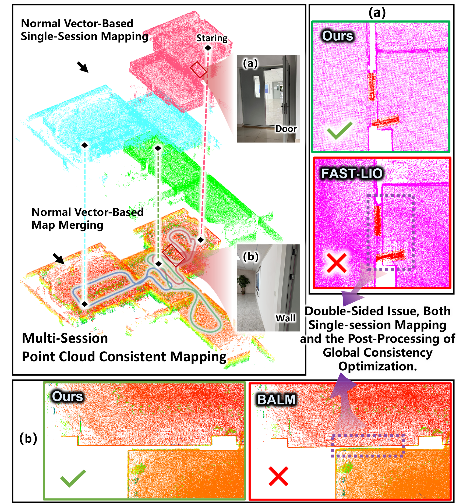

  <h1>NVMS-SLAM</h1>
  <h2>a normal vector-based multi-session LiDAR SLAM system tailored for indoor environments</h2>
<!--   
<strong>Official implementation of our paper in <i>IEEE Transactions on Intelligent Vehicles (T-IV), 2024</i></strong>

   
  
  
  
   -->

<!-- 

  

   

-->
## Abstract

**Contributors**: [Yongxin Ma](https://github.com/lian-yue0515), [Chengwei Zhao](https://github.com/chengwei0427), [Jie Xu](https://github.com/jiejie567), Yixuan Li, Xuanxuan Zhang, Shenghai Yuan, [Tian Zhi](https://github.com/zht1117), Lihua Xie 

## 1. Prerequisites
### 1.1 Ubuntu and ROS

Ubuntu >= 18.04.

ROS >= Melodic. [ROS](http://wiki.ros.org/ROS/Installation)

### 1.2 PCL && Eigen && gtsam

PCL >= 1.8, Follow [PCL](http://www.pointclouds.org/downloads/linux.html).

Eigen >= 3.3.4, Follow [EIGEN](http://eigen.tuxfamily.org/index.php?title=Main_Page).

gtsam >= 4.0.0, Follow [gtsam](https://gtsam.org/get_started/).

### 1.3 livox_ros_driver

Follow [livox_ros_driver Installation](https://github.com/Livox-SDK/livox_ros_driver).

## 2. Build

## 3. Directly run

## 4. Rosbag Example
### 4.1 Simulated Dataset
Download our test bags here: [geogle]().
### 4.2 Real-world Dataset
Download our test bags here: [geogle]().
### 5. Example results 

### Acknowledgements 

### License 
The source code is released under [GPLv2](http://www.gnu.org/licenses/) license.

